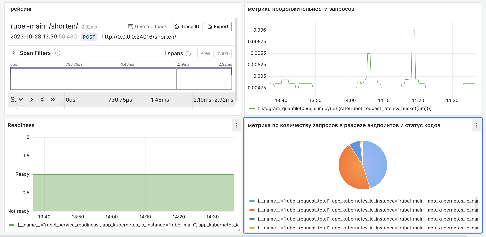

#####  Инструкции предназначены для операционной системы macOS
### Инициализация рабочего окружения
- Добавить корневую директорию в `PYTHONPATH` (временно): 
    ```
    export PYTHONPATH="$PYTHONPATH:."
    ```
- Установить и активировать poetry.
    ```
    poetry install
    poetry shell
    ```

### Для запуска 
- #### Подготовка для запуска в Docker
Поднять контейнер с PostgreSQL
```
docker compose up postgres
```
Выполнить скрипт `tools\preparing_db.sql` для создания БД 
- #### Подготовка  для запуска в Kubernetes
```
helm install postgres helm/postgres/
```
создать БД 
- войти в pod `kubectl exec --stdin --tty NAME_POD -- /bin/bash`
- подключиться к бд `psql -h localhost -p 5432 -U admin`
- создать `CREATE DATABASE url_mapping;`
- создать `CREATE DATABASE url_mapping_test;`
- удостовериться `SELECT datname FROM pg_database;`
База должна быть доступна
```
kubectl port-forward svc/postgres 5432:5432
```
### Запуск 
- #### Локально
```
export POSTGRES_USER=admin
export POSTGRES_PASSWORD=password
export POSTGRES_HOST=localhost
export POSTGRES_DB_NAME=url_mapping
python3 src/app/main.py
```
- #### B Docker
```
docker compose up url_shortener
```
проверить отклик `curl http://localhost:8000/healthz/up`
- #### B kubernetes (HELM-Chart)
```
helm install url-shortener helm/url-shortener/
```
uninstall
```
helm uninstall url-shortener
```

### Тестирование
- #### B Docker и  Kubernetes
Приложение уже поднимается в тестовом режиме, если нужно иное - убрать постфикс `_test` из переменной `POSTGRES_DB_NAME`.
- #### Локально
Использовать тестовую базу данных 
```
export POSTGRES_DB_NAME=url_mapping_test
pytest src/tests -v
```
#### Для определения тестового покрытия 
```
pytest --cov=src/app src/tests
```
### Linting
```
flake8 src
```

### Сборка образов
- #### Локально
```
docker build -t url_shortener:1 .
```
- #### Для GitLab
```
docker build -t registry.gitlab.com/ekaterinar/url_shortener:1 .
docker push registry.gitlab.com/ekaterinar/url_shortener:1
```
### Swagger
При наличии UI и активном сервисе - документация доступна по адресу `http://0.0.0.0:8000/docs`

Иначе для получения документации в виде файла - выполнить в консоле
```
curl -k http://0.0.0.0:8000/openapi.json > swagger/openapi.json
```

Открыть в удобочитаемом виде можно на сайте [Swagger UI](https://editor.swagger.io/)
`File -> Clear Editor -> вставить json из swagger/openapi.json`
При необходимости преобразовать в yaml - согласиться.

### Управление миграциями
При инициализации миграций использовался шаблоня`async` 
```
alembic init -t async
```
Генерация новой миграции
```
alembic revision --autogenerate -m 'nametable__definition'
```
Применение миграций
```
alembic upgrade head
```

### Иммитация запросов клиента для сбора метрик
Развернуть сервис в kubernetes. Приложение должно быть доступно.
```
kubectl port-forward svc/url-shortener 8000:8000
```
Выполнить необходимые запросы из файла `src/client_imitation/client_imitation.py`
Выполнить настройку или импортировать Dashboard в Grafana

